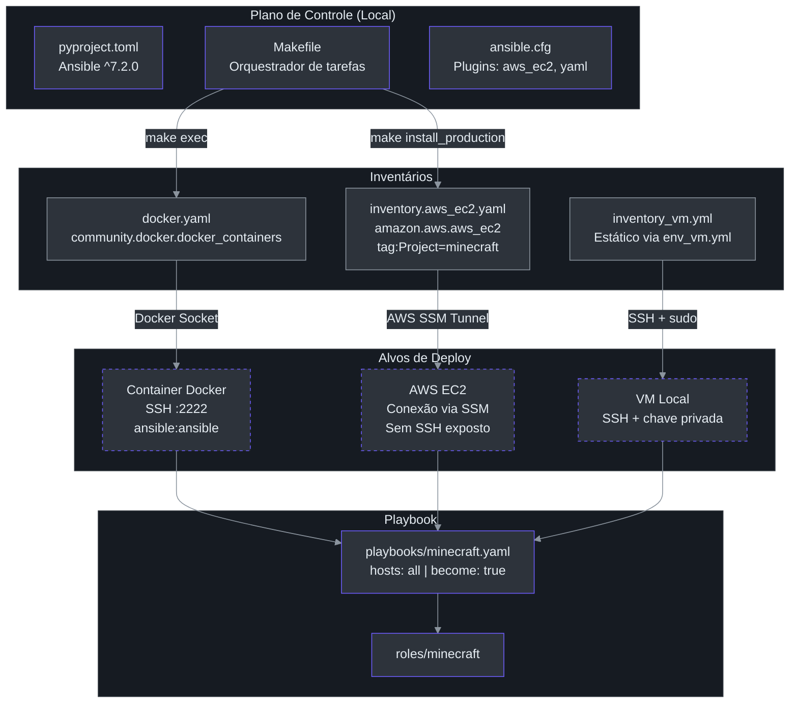
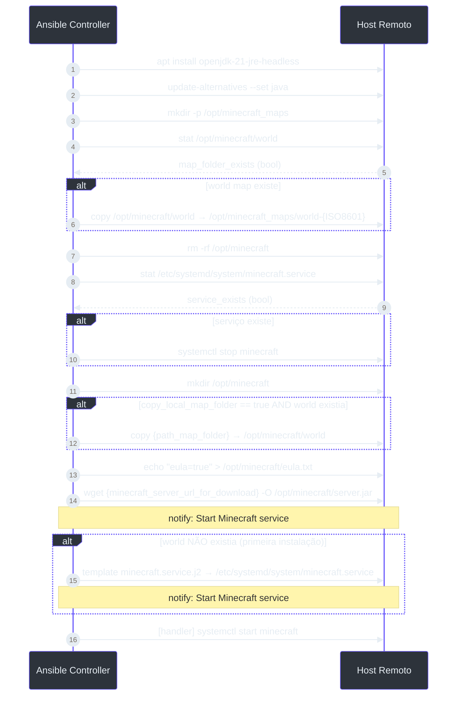
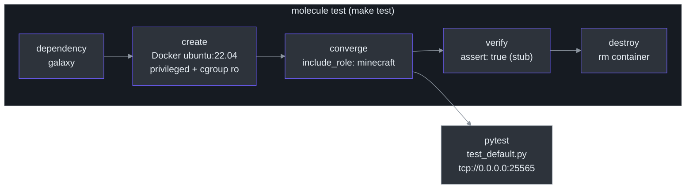

# Arquitetura — minecraft-ansible

Deep-dive para engenheiros que precisam entender as decisões de design, o fluxo de dados e os modos de falha do sistema.

---

## Filosofia do Sistema

O projeto é centrado em **idempotência destrutiva**: a cada execução, o diretório `/opt/minecraft` é **completamente removido e recriado** a partir de zero. Isso elimina estado residual entre deploys às custas de um downtime intencional. O único estado preservado entre execuções é o **world map**, que é copiado para `/opt/minecraft_maps/` com timestamp ISO 8601 antes da destruição.

> **Invariante principal**: a role `minecraft` pode ser executada N vezes no mesmo host e sempre produz o mesmo estado final — servidor rodando, EULA aceita, serviço systemd ativo.

---

## Diagrama de Arquitetura Geral



---

## Fluxo de Execução da Role

O diagrama a seguir mostra a sequência **real** de tasks executadas em `roles/minecraft/tasks/main.yml`, incluindo as condicionais.



**Atenção ao condicional da task 14** (`roles/minecraft/tasks/main.yml:89`): o arquivo de serviço systemd **só é (re)criado quando não havia world map**. Isso significa que em re-deploys de um servidor já existente, a unidade systemd não é sobrescrita — apenas o JAR é atualizado e o serviço é reiniciado via `notify`.

---

## Análise dos Inventários

### `inventories/docker.yaml` — Desenvolvimento Local

```yaml
plugin: community.docker.docker_containers
host: "unix://var/run/docker.sock"
keyed_groups:
  - prefix: docker
    key: 'docker_name'
```
*(inventories/docker.yaml:1-6)*

Descobre containers via socket Docker local. O grupo gerado é `docker_minecraft` (prefixo + nome do container). Usado exclusivamente com `make exec` e `make check`.

### `inventories/inventory.aws_ec2.yaml` — Produção AWS

```yaml
include_filters:
  - tag:Project:
      - 'minecraft'
compose:
  ansible_connection: '"community.aws.aws_ssm"'
  ansible_user: '"ssm-user"'
```
*(inventories/inventory.aws_ec2.yaml:11-19)*

**Por que SSM e não SSH?** EC2 instances não precisam expor a porta 22. O AWS Systems Manager Session Manager abre um túnel seguro sem inbound rules. Isso exige que a instância tenha o SSM Agent instalado e a role IAM `AmazonSSMManagedInstanceCore`.

O filtro por `tag:Project=minecraft` garante que apenas instâncias tagueadas sejam gerenciadas — proteção contra execução acidental em outras instâncias da conta.

### `inventories/inventory_vm.yml` — VM Local / Homelab

```yaml
all:
  vars_files:
    - env_vm.yml
  children:
    vm:
      hosts:
        "{{ host }}":
          ansible_ssh_user: "{{ user }}"
          ansible_ssh_private_key_file: "{{ path_ssh_private_key }}"
          ansible_sudo_pass: "{{ password_user_sudo }}"
```
*(inventories/inventory_vm.yml:1-10)*

Toda credencial é externalizada em `envs/env_vm.yml` (gitignored). O arquivo de exemplo está em `envs/env_vm.example.yml`.

---

## Serviço Systemd

O template `roles/minecraft/templates/minecraft.service.j2` gera a seguinte unidade:

```ini
[Unit]
Description=Minecraft server
After=network.target

[Service]
User=root
WorkingDirectory=/opt/minecraft
ExecStart=/usr/bin/java -Xmx1024M -Xms1024M -jar /opt/minecraft/server.jar nogui
Restart=on-failure

[Install]
WantedBy=multi-user.target
```
*(roles/minecraft/templates/minecraft.service.j2:1-12)*

**Decisões de design relevantes:**
- `User=root` — o servidor Minecraft roda como root. Isso simplifica permissões em `/opt/minecraft` mas é uma superfície de ataque caso haja exploit no server.jar.
- `-Xmx1024M -Xms1024M` — heap fixo em 1 GB. Não configurável via variável Ansible; mudanças exigem editar o template.
- `Restart=on-failure` — o systemd reinicia automaticamente em crashes, mas não em paradas limpas (`systemctl stop`).
- `After=network.target` — garante que a rede está disponível antes de iniciar (necessário para o servidor aceitar conexões na porta 25565).

---

## Variáveis: Precedência e Responsabilidade

| Variável | Arquivo | Valor Padrão | Descrição |
|---|---|---|---|
| `jdk_version` | `vars/main.yml:4` | `"21"` | Versão do OpenJDK a instalar |
| `minecraft_server_url_for_download` | `vars/main.yml:3` | URL Mojang 1.19.3+ | JAR oficial do servidor |
| `path_map_folder` | `vars/main.yml:5` | `""` | Caminho local do world map a importar |
| `copy_local_map_folder` | `vars/main.yml:6` | `false` | Habilita cópia do world map local |
| `minecraft_version` | `defaults/main.yml:2` | `"1.19.3"` | Versão declarativa (não usada nas tasks) |

> **Importante**: `minecraft_version` em `defaults/main.yml:2` é uma variável **declarativa/documentação** — ela não é interpolada em nenhuma task. A versão real do servidor é determinada pela URL em `minecraft_server_url_for_download`. Manter as duas em sincronia é responsabilidade manual.

Em Ansible, `vars/main.yml` tem **precedência maior** que `defaults/main.yml`. Sobrescrever via linha de comando: `ansible-playbook ... -e jdk_version=17`.

---

## Modos de Falha

| Cenário | Comportamento | Mitigação |
|---|---|---|
| `server.jar` inacessível (URL inválida) | Task `get_url` falha; role aborta **antes** de iniciar o serviço. O diretório `/opt/minecraft` existe mas vazio. | Verificar URL e reexecutar; idempotente. |
| World map não existe no primeiro deploy | `stat` retorna `exists: false`; backup é pulado; serviço é criado normalmente. | Comportamento esperado. |
| Serviço `minecraft` não existe no primeiro deploy | `stat` retorna `exists: false`; `systemctl stop` é pulado. | Comportamento esperado. |
| `copy_local_map_folder: true` mas `path_map_folder` vazio | A task `copy` tenta copiar `""` — erro de módulo Ansible. | Sempre definir `path_map_folder` quando habilitar `copy_local_map_folder`. |
| Falha no backup do world | Se `/opt/minecraft/world` existe mas a cópia falha (disco cheio, permissões), a role aborta **antes** de destruir o diretório. | O mundo original permanece intacto; investigar espaço em disco. |

---

## Pipeline de Testes (Molecule)



O container de teste é **privileged** com `/sys/fs/cgroup` montado como read-only para permitir que o systemd funcione dentro do container — necessário para a task `systemd` da role funcionar durante `converge`.

*(roles/minecraft/molecule/default/molecule.yml:10-14)*

O único teste funcional real está em `roles/minecraft/molecule/tests/test_default.py:5`:
```python
def test_minecraft_running(host):
    assert host.socket("tcp://0.0.0.0:25565").is_listening
```

O `verify.yml` contém apenas `assert: true` — é um stub a ser expandido.
